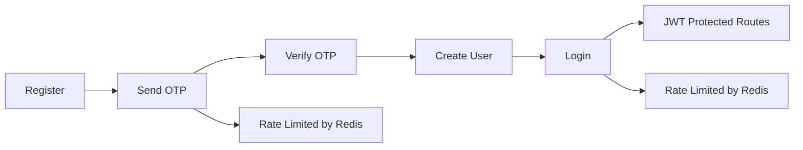

# SheetXray Backend

<p>
	
	
	
	
	
</p>

SheetXray is the backend for a spreadsheet assistant that lets users register, log in, organize files into folders, upload sheet documents, and prepare data for future query/chat workflows.

## Highlights

- User auth with JWT access and refresh tokens
- OTP-based registration flow
- Redis-backed rate limiting for login and OTP requests
- Folder management for organizing uploaded sheets
- File upload support through Multer and Cloudinary
- Protected routes for user, folder, and sheet operations

> Login and OTP endpoints are rate-limited through Redis to reduce abuse and repeated attempts.

## Flow At A Glance



## Tech Stack

- Node.js
- Express 5
- MongoDB and Mongoose
- Redis via ioredis
- Multer for multipart form handling
- Cloudinary for file storage
- JWT and cookie-parser for authentication

## API Base

All routes are mounted under:

`/api/v1`

Example:

`POST /api/v1/users/login`

## Routes

### User Routes

| Method | Endpoint                            | Auth   | Purpose                                                    |
| ------ | ----------------------------------- | ------ | ---------------------------------------------------------- |
| POST   | `/api/v1/users/otpsender`           | Public | Send OTP to the provided email and apply OTP rate limiting |
| POST   | `/api/v1/users/register`            | Public | Register a user after OTP verification                     |
| POST   | `/api/v1/users/login`               | Public | Log in and issue tokens with login rate limiting           |
| POST   | `/api/v1/users/refreshAccessToken`  | Public | Refresh the access token                                   |
| POST   | `/api/v1/users/logout`              | JWT    | Log out the current user                                   |
| GET    | `/api/v1/users/profile`             | JWT    | Get the logged-in user profile                             |
| PATCH  | `/api/v1/users/updateprofileavatar` | JWT    | Update the user avatar                                     |
| POST   | `/api/v1/users/updatepassword`      | JWT    | Update the user password                                   |
| PATCH  | `/api/v1/users/updateemail`         | JWT    | Update the user email                                      |

### Folder Routes

| Method | Endpoint                                         | Auth | Purpose                               |
| ------ | ------------------------------------------------ | ---- | ------------------------------------- |
| POST   | `/api/v1/folders/createfolder`                   | JWT  | Create a folder                       |
| GET    | `/api/v1/folders/getalluserfolders`              | JWT  | List all folders for the current user |
| DELETE | `/api/v1/folders/deletefolder/:folderid`         | JWT  | Delete a folder                       |
| GET    | `/api/v1/folders/getallsheetsinfolder/:folderid` | JWT  | List all sheets in a folder           |
| POST   | `/api/v1/folders/query/:folderid`                | JWT  | Query a folder                        |

### Sheet Routes

| Method | Endpoint                               | Auth | Purpose                         |
| ------ | -------------------------------------- | ---- | ------------------------------- |
| POST   | `/api/v1/sheets/uploadsheet/:folderid` | JWT  | Upload a sheet file to a folder |

## Environment Variables

Create a `.env` file in the project root with values similar to:

```env
PORT=3000
CORS_ORIGIN=http://localhost:5173
MONGODB_URI=mongodb://127.0.0.1:27017
JWT_SECRET=your_access_secret
JWT_EXPIRES_IN=1d
JWT_REFRESH_SECRET=your_refresh_secret
JWT_REFRESH_EXPIRES_IN=7d
REDIS_HOST=127.0.0.1
REDIS_PORT=6379
REDIS_PASSWORD=
cloudinary_name=your_cloud_name
cloudinary_api_key=your_api_key
cloudinary_api_secret=your_api_secret
```

## Local Setup

1. Install dependencies.

```bash
npm install
```

2. Start Redis if you are using the included Docker Compose setup.

```bash
docker compose up -d
```

3. Create the `.env` file and fill in the variables above.

4. Start the server.

```bash
npm start
```

## Project Structure

- `src/controllers` contains route handlers
- `src/middlewares` contains auth, OTP, upload, and rate-limit middleware
- `src/models` contains Mongoose schemas
- `src/routes` defines the API endpoints
- `src/utils` contains shared helpers

## Notes

- The current backend already supports user auth, folder management, and sheet uploads.
- Login and OTP requests are protected with Redis-backed rate limiting.
- The query route is available on folders, which is the current entry point for spreadsheet question workflows.
- Future RAG features can be layered on top of the existing upload and folder pipeline.
